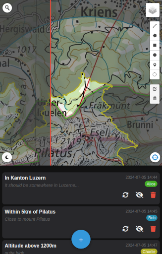
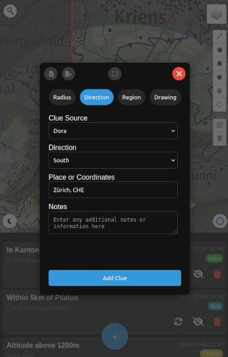

# GeoClues 🗺️

[](https://www.gnu.org/licenses/agpl-3.0.en.html)
[](#)


GeoClues is an interactive web application I've built for a weekend adventure with friends. Utilizing the Leaflet.js library for map rendering, it enables users to plot clues and hints directly on the map. All data is stored locally, allowing for static hosting of files. While some clue types are specific to Switzerland, many are applicable to other countries as well.

 

## ✨ Features

- **Mobile-Friendly Design:** 📱 Optimized for mobile use, ensuring a smooth experience on the road, searching for your location.
- **Interactive Map:** 🗺️ Utilizes Leaflet.js to display and interact with maps.
- **Clue Management:** 🕵️ Add, invert, hide, and delete clues with various parameters:
  - Radius-based clues
  - Directional clues
  - Region-specific clues
  - Altitude-based clues
  - Custom drawing clues
- **Local Storage:** 💾 All data is stored locally on the device and can be exported/imported for backup or sharing.
- **Dark Mode:** 🌑 The UI comes in dark-mode only. The maps can be toggled to dark mode too, to save battery, and because it just looks quite nice.
- **Multiple Map Layers:** 🌐 Switch between different map types including Google Maps, satellite imagery, and Switzerland-specific layers.
- **Geolocation:** 📍 Easily find and mark your current location and orientation on the map.
- **Search Functionality:** 🔍 Look up places and coordinates directly within the app.

## 🚀 Demo

A live demo of GeoClues is available at [pascscha.ch/geoclues](https://pascscha.ch/geoclues)

## 🛠️ Installation

To set up GeoClues locally:

1. Clone this repository:

   ```bash
   git clone https://github.com/pascscha/GeoClues.git
   ```

2. Navigate to the project directory:

   ```bash
   cd GeoClues/geoclues
   ```

3. Due to CORS, it won't work to just open `index.html` directly, but you need some sort of webserver that can serve these static files. With Python you could do:

    ```bash
    python3 -m http.server
    ```

No server setup is required as GeoClues runs entirely in the browser.

## 📖 Usage

- Open the application in your web browser.
- Click the '+' button to add a new clue.
- Choose the clue type and fill in the required information.
- Use the map controls to navigate and interact with the clues.
- Utilize the import/export functionality to save or share your clues.
- For drawing clues: First draw something on the map, then add a new clue of type "drawing". This will bake the current drawing into a clue that persists across reloads.

## 🤝 Contributing

Contributions to GeoClues are welcome! Please feel free to submit a Pull Request.

## 📄 License

This project is licensed under the GNU Affero General Public License v3.0 (AGPL-3.0).

You can find a copy of the license in the [LICENSE](LICENSE) file or visit [https://www.gnu.org/licenses/agpl-3.0.en.html](https://www.gnu.org/licenses/agpl-3.0.en.html) for more details.

## 🙏 Acknowledgments

This work depends on the great work of many projects, these are a few of the core projects we're based on:

- [Leaflet.js](https://leafletjs.com/) for the interactive mapping functionality.
- [Turf.js](https://turfjs.org/) for geospatial analysis.
- [ESRI](https://www.esri.com/) for geocoding services.
- [Swiss Federal Office of Topography](https://www.swisstopo.admin.ch/) for Switzerland-specific map layers.
- The border and altitude data hosted in this project were extracted from [opendata.swiss](https://opendata.swiss/). It's really nice that such data is available to everyone.
